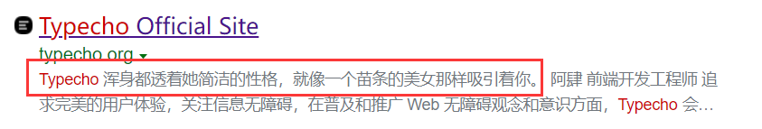

## 前言

大概是一年前的这个时候，我头脑发热使用Hexo+github pages创建了自己的第一个Blog，并凭着一股热情在不懂大部分原理（甚至几乎不知道node.js是何物）的情况下跟着各路博客、视频、知乎文章美化博客。当时选用的主题是最最最常见的Next，我从各个地方学来野路子对他魔改一番，达到了还不错的显示效果。当时我感觉这一切很有成就感，现在回过头来感觉羞愧难耐——很多魔改都是主题自带的功能我却重写一遍，其他非自带功能我也魔改的不伦不类。

其实现在看来魔改Next并不是一个很好的选择，因为有很多已有的主题能够符合我的要求，而Next本身就是为喜欢简介风格的人士准备的，我去爆改他总有些不伦不类。但很多时候，一腔热情是很重要的，至少能够在当时的场景下支撑着我把事情做完，即使后来重新审视这件事情是多么的小儿科，但至少曾在认识尚浅的时候把事情做的还算不错。

唉，又说了一堆废话作为前言。

## 为什么这么久不更新

从我开博客到现在不过一年时间，而距离我上次更新已经相隔10个月，为什么我竟然这么久都没有更新呢？

是因为我太忙了吗？我很想说是，但这明显只是个借口；想想，很多比我更忙的人其实一直在坚持更新博客，而我即使有时间也并没有用来写博客做记录。

是因为懒吗？我想是的，很多时候明明想了挺多，也挺想记录下来，可当我真正坐到博客编辑页之前，又好像懒于打字，思维骤停，就好像水龙头一下子被拧上了。于是干脆关掉编辑器做别的去了。

是因为写博客优先级太低吗？是的，我从来没把写博客当成一件要紧的事，一般只要有别的作业或是什么事情没做完，我绝不会想到先去记一下博客；即使所有事情都做完了，我第一个想到的还是娱乐；即使玩到不想再玩了，我又有什么时间和精力去写博客呢？

是因为害怕写错什么吗？这个有一点，主要是在记录技术时总担心自己有理解不到位的地方，怕误导别人。对我自己来说，通过博客记录自己的想法远比记录技术快乐得多，但是很多想法又不是能随意公开的，于是每每坐到编辑页面前，思来想去还是放弃了。

## 为什么重新开博客

既然有这么多的理由，那为什么我又重新开了博客呢？

其实本质上还是因为我有一些东西想要记录下来。

上面的问题都解决了吗？

有些解决了，有些转念一想也算是解决了。

对于时间和优先级问题，人这一生很少能有什么时候真正空闲下来，比如我说“等我有空了再去XXX把”，那这事很可能遥遥无期了；既然如此，就应该把博客的优先级提前一点，做事情累了，写写博客，不也是一种放松吗？

对于害怕误导别人的问题，其实很久之前我就意识到了，写博客最大的作用是给自己看，记录自己的学习生活的，既然如此，自私一点说，管别人干什么？别人偶然看到，若是能学到点东西，我自然无比荣幸；若是对其造成了误解，我大概也没有什么办法，也没有太多必要过于愧疚；若是别人能在评论中帮我指出问题，这自然是意外之喜，让我无比感激。总体来说，只要不是满篇胡说八道，本着较为严谨求实的态度，写博客于人于己还是利大于弊的。

至于说太懒，其实打打字也不会类到哪去，实在懒了上语音转文字好了。😁

## 关于博客技术的选择

上次建博客的时候，我啥也不懂，不带脑子随大流上了Hexo+Next的车。现在看来，这样做还是有好处的，毕竟是采用了国内最多人采用的方案，遇到的问题总能通过搜索解决。

但是一方面Next的功能的外观其实有点不合我口味，另一方面我也羞于拿我不伦不类的魔改界面展示给别人，因此我还是决定认真调研一下常见的博客技术并做一点记录。

说是认真调研，其实也不过看了一点别人的说法，结合我去各自官网上查看了文档而已，真正上手测试的只有Typecho和Hexo……

### 动态与静态博客的选择

什么是动态与静态博客呢？一言以蔽之，前者带有后端、文章等信息存储在数据库里；后者不带后端，由静态页面生成器生成后作为静态页面发布。根据我的理解两者特点如下：

动态博客：
- 需要后端和数据库，因此不能部署在各种码云带有的pages上，需要自己有服务器（很多时候是云服务器），并最好配备域名。顺便，服务器和域名一般都要钱的hhh...
- 由于要进行数据库查询，响应速度一般略慢于静态博客。
- 不需要使用静态页面生成器，可以在任何能够联网的场合使用浏览器访问页面写博客与进行管理。
- 轻松支持评论等功能，存到数据库里即可。
- 常用的动态博客框架有WordPress（功能多，不止可以做博客）、Typecho（轻量化）等，二者后端均为PHP

静态博客：
- 无后端和数据库，可以方便部署在各种码云的pages上，方便快捷，还免费。
- 直接请求页面，访问速度较快。
- 需要使用静态页面生成器，因此很可能需要有一个本地环境支持才能进行编辑与管理。（但这里我脑洞一下，是不是可以借助GitHub的CI/CD或是github.dev来简化编辑难度，达到一种只要能访问码云就可以编辑的效果呢？我没有尝试，我感觉有可行性，这样静态也就没有那么大的限制了。）
- 评论等功能需要额外支持。（但不得不说借助GitHub的issue来存储评论信息真是一大福音）
- 常用的静态博客生成器有Hexo（基于Node.js）、Hugo（基于Go）、Jekyll（基于Ruby）等。

### 常用博客框架的特点（我理解的）

1. [WordPress](https://cn.wordpress.org/)
   
   动态框架，功能和插件非常全面，可以比较轻松的构建出不只包含博客的各种网站。在搜索资料时我没有尝试使用该框架，但是感觉WordPress的资料还是相当多的，插件也足够丰富，日后我会考虑在自己购买的云服务器上尝试一下。另外值得一提的是，之前在软工项目调查网站使用语言时，我发现即使在2022年PHP语言竟然在网站中博得头筹，这让我大为不解；现在看来，恐怕是有不少网站和个人博客直接采用了WordPress或Typecho导致了这种结果吧。

2. [Typecho](http://typecho.org/)
   
   前几天我突发奇想，既然树莓派都可以作为服务器使用，那么各方面功能无疑更加强大且完善的旧手机（除了不方便作为嵌入式开发板）为什么不能呢？经过调查我发现了基于[KSWEB](https://kslabs.ru/)的方案。

   KSWEB是一款Android服务器APP，使用lighttpd+nginx+apache+php+sql技术，各方面功能完善可用于搭建建议网站。

   正好为了测试KSWEB和动态博客框架，我在我的平板上安装了KSWEB并使用Typecho搭建了简易的本地博客。我感觉Typecho对于搭建博客来说，各方面资料及插件应该是足够了，上手非常容易，按照网上的说法要求的配置也比WordPress低，可以一试。

   后来我又尝试进行内网穿透，我使用的是免费的[cpolar](https://www.cpolar.com/)。运行方法是使用[Termux](https://termux.com/)安装与使用；Termux是一个是一款模拟Linu的APP，无需root，可以使用apt安装各种包。这套方案还算比较稳定，我自己在家里连接穿透后的网址还是相当不错的，但是不知道为啥发给别人测试却速度奇慢，或许在自家访问有什么特殊的优化？

   后来我又了解到了[AidLux](https://www.aidlux.com/)，可以让Android手机直接变成Linux电脑，装在平板上更是极为合适，爱奇艺变生产力了有木有。我暂时还没有折腾太多，但是感觉真的用它作为服务器也是完全可行的。

   呃扯远了，总体来说Typecho轻量可用，但是外面想要访问还是存在一定的问题，使用各种小东西（手机、树莓派等）构建家庭网站甚为不错（但是这样真的有很大意义吗），真想分享给别人看可能还得是正经服务器（但就算是用云服务器，国内这些服务商较低的带宽能有多大的访问速度呢？这有待我进一步尝试）。

   顺便吐槽一下官网😥

   

3. [Hexo](https://hexo.io/zh-cn/index.html)
   
   基于Node.js的静态博客生成器，国内使用人数颇多以至于铺天盖地的Hexo+Next建站方案……

   实现效果还是非常不错的，文档和各种资料非常全，基本不用担心遇到什么问题；主题和插件相当多，可以实现各种功能；而且静态博客基于Pages的方案是免费的。个人感觉对于小白来说Hexo应该是首选。

   缺点是网传当文章数较多时，因为Node.js解释型语言的特点，速度还是有点慢的。具体我没有测试，网上给出的测试情况大概比Hugo慢5~10倍，但我想我大概一时半会体会不到这种慢……

4. [Hugo](https://gohugo.io/)
   
   基于Go语言的静态博客生成器，我暂时没找到很好的中文文档，但是英文文档还算是比较全。网上的讨论热度比起Hexo好像也没有低多少，遇到问题应该是都能解决的。

   优点就是速度快，毕竟是编译型语言，速度还是比较有保障的。博文较多的小伙伴可以考虑迁移到Hugo。

   由于我没有尝试，我对于他的认知仅限于网上其他博客的讨论。大概是主题偏少（实际上有那么一套稳定且符合需求的主题就足够了）、没有主题配置文件（这个我感觉有点奇怪，这个设计怎么看起来不太成熟的样子，这样能很好的维护吗？）。

   我感觉Hugo还是不错的，未来博文多了或许会考虑迁移过来。
   
5. [Jekyll](https://jekyllrb.com/)
   
   基于Ruby，也是Github pages的默认渲染方式。我了解不多，感觉网上的讨论对比上两个确实偏少，于是不考虑使用了。

6. [VuePress](https://vuepress.vuejs.org/zh/)
   
   基于Vue，现在用的人还是偏少了，据说非常自由，但我不是很想折腾。其实我还是比较看好这个的。

7. Others
   
   其实还是有不少其他方案的，这边说的都是相对来说比较常用的，对于我这样的新手，还是尽量套用前人的轮子吧。因此其他方案没有过多研究。

### 我的选择

看了以上一堆胡言乱语的分析，你猜我选择了什么？

我暂时选择使用Hexo框架，因为资料最多最容易上手。日后如果博文变多了生成速度过慢，我会考虑迁移到Hugo中。

至于说动态博客，我觉得还是挺有意思的，或许会额外在云服务器上使用WordPress建一个玩玩，但是就不作为主力博客了。

## 关于博客主题的选择

鉴于[Next](https://theme-next.js.org/)主题实在是过于烂大街，且他的简洁风格不是我喜欢的样式，因此我需要寻找新的主题。

于是我来到[Hexo主题网站](https://hexo.io/themes/index.html)寻找。其实好看的主题还是有不少的，但是经常点看一看star很少，怕是用户不多，这很可能意味着主体功能不够完善需要折腾。鉴于之前折腾的经历并不美好，我希望能直接找到符合我要求的主题。

我先是找到了[Aurora](https://github.com/auroral-ui/hexo-theme-aurora)主题，感觉还是挺炫酷的，但是一看issues，好家伙现阶段怕是还有不少bug，还是暂时不折腾了。

没想到最后我还是投入了[Butterfly](https://butterfly.js.org/)的怀抱。不得不说，Butterfly各方面还是非常完善且美观的，而且一直维护的很好（star 4.1k，远超Next 1.6k），适合作为Next的替代品新手上手。实际上日常查阅资料中Butterfly的烂大街程度并不比Next低多少（甚至可能比Next要更多见），但是其出色的自定义化程度让他很容易显示出个人的风格，让我们并不感觉他有多么常见。

接下来就是按照官方教程做优化了。讲真配置项还是挺多的，花了我半个上午+一整个下午的时间才算配置出了我比较喜欢的样子。官方教程讲的很详细，除了PWA的配置不知道是不是没有更新存在一些问题，其他的都很好。但是改配置怎么看都是体力活，花了这么多时间还是挺可惜的。

## 结语

唔，不管怎么说，博客总算是复活啦！接下来就是用它记录下生活，充分发挥博客的价值吧~😄