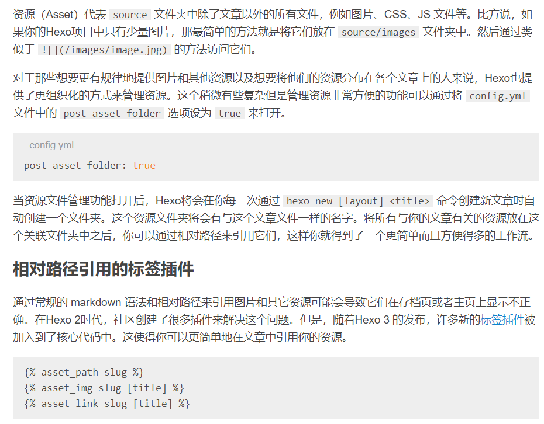
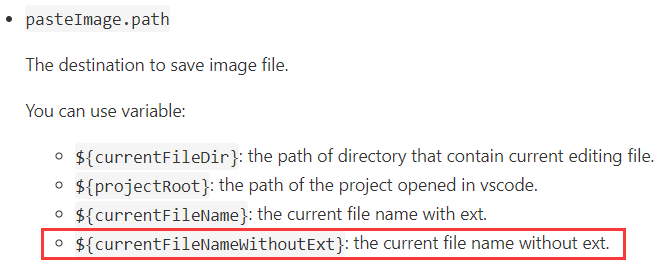

算是当时建站留下的一点坑，博客一直没有插入图片的功能，这对于显示当然及其不友好。这学期我转用markdown进行课堂笔记，最近突发奇想想将笔记转移到博客上，这样的话没有图片肯定是不行的，于是稍微折腾了一下。

<!-- more -->

其实网上比较推荐的做法是使用“七牛”等网络图床，网络存图有好处也有缺点，我想还是用本地方案得了，遂放弃（才不是懒得研究）
本地方案其实也不难，按照[hexo的官方文档](https://hexo.io/zh-cn/docs/)来做十分容易，核心如下：

其实就是全局配置打开资源文件夹，然后用一些特定格式加入图片就行，markdown自带的插入图片格式也是可以用的，虽然官方说有些缺点。

问题在于为了做课堂笔记，想要插入图片必须要快速高效，因此需要使粘贴插图的默认位置在资源文件夹中。使用markdown all in one的默认位置使./image/[post_name]/pic_name，这样显然不行，仔细寻找了markdown all in one的设置也没有设置图片位置的方法，于是只能用其他方法来做到。
网上找到了一些方法，最后发现[Paste Image](https://marketplace.visualstudio.com/items?itemName=mushan.vscode-paste-image)插件比较符合我的需求，可以按相对位置插入图片，也可以改变图片存储位置，只是粘贴的快捷键需要使用CTRL+ALT+V，稍微麻烦，但无伤大雅。

不算什么有用的文章，仅作记录。
