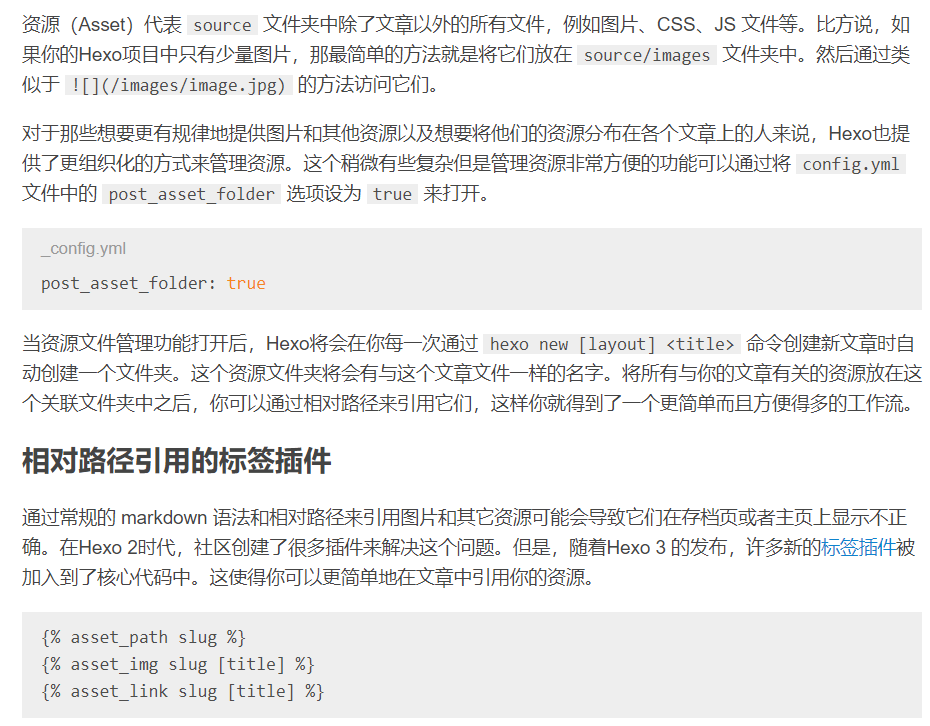

算是当时建站留下的一点坑，博客一直没有插入图片的功能，这对于显示当然及其不友好。这学期我转用markdown进行课堂笔记，最近突发奇想想将笔记转移到博客上，这样的话没有图片肯定是不行的，于是稍微折腾了一下。

<!-- more -->

其实网上比较推荐的做法是使用“七牛”等网络图床，网络存图有好处也有缺点，我想还是用本地方案得了，遂放弃（才不是懒得研究）
本地方案其实也不难，按照[hexo的官方文档](https://hexo.io/zh-cn/docs/)来做十分容易，核心如下：

其实就是全局配置打开资源文件夹，然后用一些特定格式加入图片就行，markdown自带的插入图片格式也是可以用的，虽然官方说有些缺点。

问题在于为了做课堂笔记，想要插入图片必须要快速高效，因此需要使粘贴插图的默认位置在资源文件夹中。使用markdown all in one的默认位置使./image/[post_name]/pic_name，这样显然不行，仔细寻找了markdown all in one的设置也没有设置图片位置的方法，于是只能用其他方法来做到。
网上找到了一些方法，最后发现[Paste Image](https://marketplace.visualstudio.com/items?itemName=mushan.vscode-paste-image)插件比较符合我的需求，可以按相对位置插入图片，也可以改变图片存储位置，只是粘贴的快捷键需要使用CTRL+ALT+V，稍微麻烦，但无伤大雅。


不算什么有用的文章，仅作记录。


---

## 更新 2022-7-16

---

时间来到了2022-7-16，没想到我重新建站又被插入图片ex了一下，因此有必要具体分析并做详细记录。

首先是解决方案。如果使用图床，免费的既有不小的空间基本够用，但是访问速度可能会有点不够；但即使氪金，个位数的价格即能在半年到一年的时间里获得不错的体验了。总体来说，价格完全完全可以接受。要说问题的话，如果使用Typora书写，自然可以很方便的上传图床，简直nice！但是Typora不再免费提供，有必要考虑其他方案。Vscode我没有仔细研究，猜测借助各种插件也是可以的，同时我也猜测没有Typora那么方便；不过这些纯属我个人根据经验意淫，因为我没有真正去尝试……

我个人还是倾向于本地方案（+Github）解决的，毕竟这种解决方案免费且比较稳定（真的稳定吗？）。好吧其实还是我懒了。

没想到时隔一年，[Paste Image](https://marketplace.visualstudio.com/items?itemName=mushan.vscode-paste-image)插件依旧是首选方案。但是一年前我的具体解决方案并没有记录，这一年里也不知道怎么回事Paste Image好像配置都消失了，无奈我只得重新记录一下。

按照之前记录的方式（其实我也有重新查阅资料，但是方法并没有变化），我们可以使用hexo的标签插件（``）的方式插入图片，也可以使用html的`img`标签灵活的插入图片，但是我最常用的自然还是markdown的``的写法。

这里的原理就是使用Paste Image插件的自定义功能，在粘贴图片时一下插入两段插入图片的代码，一段带有资源文件夹（资源文件夹是什么上面有说过）路径而另一段不带有，这样在本地预览时看到的就是第一段代码插入的图片，而使用Hexo生成静态网页时，博文和博文资源文件夹中的图片被放到了同一目录下，这样第二段图片代码起作用展示图片。

这里需要注意的是，两段插入图片代码的方括号中在粘贴时都不要有内容，如果要给出提示加到第二段代码的方括号中。这样在网站上运行时，第一段代码请求图片一定是失败的，但是由于没有在方括号中给出提示性文字，相当于啥也不显示；而第二段代码如果由于网络问题也请求失败了，此时会显示第二段代码方括号里的内容作为提示。

这一解决思想其实也挺丑陋的，但是不失为一个可用的方案，如果想同时在本地预览并在Blog上看到、还不想使用图床，那么可以一试。我猜测未来大概会有更优雅的方法，到时候我再更换吧。

顺便提一下，问了有多年Blog经验的[skyleaworlder](https://skyleaworlder.github.io/)，得知他写博客并不需要本地预览，直接写完提交就行了。看来我还是写少了……

又扯远了，回到具体解决方法上来。我重新阅读了[Paste Inage的说明文档](https://marketplace.visualstudio.com/items?itemName=mushan.vscode-paste-image)，发现其实只需要改一个地方就能满足需求，于是修改如下：


其实就是改了一下插入的Pattern，改为以下代码：

```
${imageSyntaxPrefix}${imageFilePath}${imageSyntaxSuffix}
```

该配置的默认项为前3个变量（`${}`）内容，我在后面添加了``，相当于插入上文所说的第二段插入图片代码。此时使用`Ctrl+Alt+V`粘贴图片效果如下（一下展示的是上面的配置截图的图片代码）：

```

```

好吧，虽然很啰嗦很丑陋，但是总算是完成了我预想的要求，先这样把博客写起来吧~
